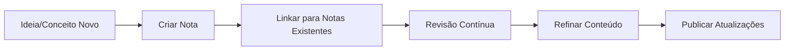

# 📚 Repositório de Notas de Estudo em Programação


Repositório dedicado à organização das minhas notas de estudo sobre desenvolvimento de software, tecnologias e conceitos relevantes. Todas as notas são criadas no Obsidian usando Markdown para máxima portabilidade e eficiência.

## 🧠 Propósito
- Consolidar conhecimento técnico de forma estruturada
- Criar um banco de conhecimento pesquisável para consulta rápida
- Compartilhar aprendizados com a comunidade
- Evoluir continuamente o conteúdo com novas descobertas

## ✨ Recursos Incluídos
- **Sistema de Links** entre notas para conexão de conceitos
- **Diagramas Mermaid** para visualização de conceitos complexos
- **Snippets de código** com syntax highlighting
- **Metadata YAML** para organização semântica
- **Backlinks automáticos** para rastreamento de relações

## 🚀 Como Utilizar no Obsidian
1. Clone o repositório:
```bash
git clone https://github.com/GustavoCarisRezende/study
```
2. Abra a pasta como vault no Obsidian  
3. Ative plugins essenciais:
   - Excalidraw
   - Dataview
   - Advanced Tables
   - GIT
   - Mind Map

## 🔗 Fluxo de Trabalho


## 🤝 Contribuições
Contribuições são bem-vindas! Se encontrar:
- Erros técnicos
- Conceitos desatualizados
- Melhorias na documentação

Siga o processo:
1. Abra uma issue detalhando a sugestão
2. Submeta um PR com as alterações propostas
3. Inclua referências confiáveis quando relevante

## 📜 Licença
Este repositório é licenciado sob [MIT License](LICENSE) - sinta-se à vontade para usar como referência para seus próprios estudos!

---

**Construído com**:  
[](https://obsidian.md) Obsidian 
+ 
[](https://www.markdownguide.org/) Markdown 
+ 
[](https://git-scm.com/) Git

*Criado em: {06/2025}*  
*Por: [Gustavo Caris Rezende](https://github.com/GustavoCarisRezende)*
